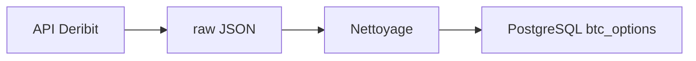

# Pipeline Deribit — options BTC

Architecture **ETL** : collecte API, validation, archive JSON et chargement PostgreSQL (Neon).

## Arborescence

```
data/
├── raw/              # JSON bruts par date (local + GitHub Actions)
│   └── YYYY-MM-DD/
│       └── btc_options_YYYY-MM-DD.json
├── logs/             # last_run.json (statut) ; *.log ignorés par git
├── scripts/          # CLI et SQL d'initialisation
│   ├── run_daily_pipeline.py
│   ├── backfill_db.py
│   └── init_db.sql
```

Code métier : `src/data/deribit/` (modules testables, séparés des scripts).

## Flux



1. **Fetch** — `get_instruments` (actives) + `get_book_summary_by_currency` (carnet / IV / OI).
2. **Raw** — sauvegarde JSON versionnée avec métadonnées (`snapshot_utc`, `record_count`).
3. **Clean** — NaN, illiquidité, spread, IV aberrantes, TTE > 0.
4. **Load** — upsert PostgreSQL (`ON CONFLICT` sur `snapshot_date` + `instrument_name`).

## Exécution

```bash
# Depuis la racine du projet, avec venv activé
pip install -r requirements.txt
cp .env.example .env   # puis éditer DATABASE_URL

# Schéma (une fois)
psql "$DATABASE_URL" -f data/scripts/init_db.sql

# Pipeline complète (JSON + Neon)
python data/scripts/run_daily_pipeline.py

# JSON seulement (sans base)
python data/scripts/run_daily_pipeline.py --skip-db

# Re-traiter un raw existant
python data/scripts/run_daily_pipeline.py --skip-fetch --date 2025-05-21

# Recharger Neon depuis les JSON déjà présents
python data/scripts/backfill_db.py
```

## Bonnes pratiques

| Pratique | Implémentation |
|----------|----------------|
| **Archive raw** | Le JSON brut n'est jamais modifié ; retraitement et backfill repartent du raw. |
| **Idempotence journalière** | Clé `(snapshot_date, instrument_name)` + upsert SQL. |
| **Config hors code** | Seuils de nettoyage et `DATABASE_URL` via `.env`. |
| **Écriture atomique** | JSON écrit en `.tmp` puis rename. |
| **Logs structurés** | Fichier par date + stdout ; `data/logs/last_run.json`. |
| **Retries API** | Backoff exponentiel sur erreurs réseau. |
| **Orchestration** | GitHub Actions (cron 00:15 UTC). |

## Règles de nettoyage (configurables)

- Champs obligatoires : `strike`, `underlying_price`, `mark_iv`, `maturity_date`
- **Illiquidité** : `open_interest` ≥ `CLEAN_MIN_OPEN_INTEREST` (défaut 0.01)
- **Bid/ask** : rejet si `bid > ask` ; spread relatif > `CLEAN_MAX_REL_SPREAD` (défaut 50 %)
- **IV** : entre 1 % et 500 % en décimal (`0.01` – `5.0`)
- **Maturité** : `time_to_expiry_years` > 0

## PostgreSQL (Neon)

Table `btc_options` : index sur `snapshot_date`, `maturity_date`, `(strike, option_type)`.

```sql
SELECT strike, option_type, mark_iv, time_to_expiry_years
FROM btc_options
WHERE snapshot_date = CURRENT_DATE
ORDER BY maturity_date, strike;
```

## Collecte automatique (GitHub Actions)

Workflow [`.github/workflows/deribit_daily.yml`](../.github/workflows/deribit_daily.yml) — **00:15 UTC** chaque jour :

1. Télécharge les options BTC Deribit
2. Commit `data/raw/` + `data/logs/last_run.json`
3. Insère dans Neon via le secret `DATABASE_URL`

Voir [docs/NEON_SETUP.md](../docs/NEON_SETUP.md) et [docs/GITHUB_ACTIONS.md](../docs/GITHUB_ACTIONS.md).

**Mode `--scheduled`** (Actions) : si Postgres est injoignable, l’échec SQL est logué mais le job peut continuer (JSON + artefact).
