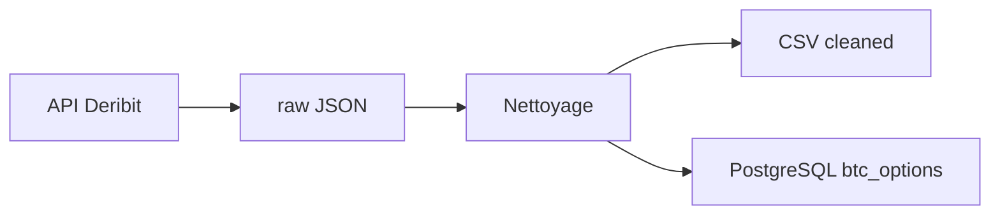

# Pipeline Deribit — options BTC

Architecture **ETL** de niveau quant / data engineering : collecte, validation, export analytique et chargement SQL.

## Arborescence

```
data/
├── raw/              # JSON bruts par date (local + GitHub Actions)
│   └── YYYY-MM-DD/
│       └── btc_options_YYYY-MM-DD.json
├── cleaned/          # CSV propres (une ligne = un instrument au snapshot)
│   └── btc_options_YYYY-MM-DD.csv
├── logs/             # last_run.json (statut) ; *.log ignorés par git
├── scripts/          # CLI et SQL d'initialisation
│   ├── run_daily_pipeline.py
│   └── init_db.sql
```

Code métier : `src/data/deribit/` (modules testables, séparés des scripts).

## Flux



1. **Fetch** — `get_instruments` (actives) + `get_book_summary_by_currency` (carnet / IV / OI).
2. **Raw** — sauvegarde JSON versionnée avec métadonnées (`snapshot_utc`, `record_count`).
3. **Clean** — NaN, illiquidité, spread, IV aberrantes, TTE > 0.
4. **Export** — CSV pour modèles (surfaces de vol, Merton, etc.).
5. **Load** — upsert PostgreSQL (`ON CONFLICT` sur `snapshot_date` + `instrument_name`).

## Exécution

```bash
# Depuis la racine du projet, avec venv activé
pip install -r requirements.txt
cp .env.example .env   # puis éditer POSTGRES_*

# Créer la base (une fois)
createdb deribit_quant
psql -d deribit_quant -f data/scripts/init_db.sql

# Pipeline complète
python data/scripts/run_daily_pipeline.py

# Sans PostgreSQL (fetch + CSV seulement)
python data/scripts/run_daily_pipeline.py --skip-db

# Re-traiter un raw existant
python data/scripts/run_daily_pipeline.py --skip-fetch --date 2025-05-21
```

## Bonnes pratiques (pourquoi cette structure)

| Pratique | Implémentation |
|----------|----------------|
| **Séparation raw / cleaned** | Le JSON brut n'est jamais modifié ; tout retraitement repart du raw (audit, rejeu). |
| **Idempotence journalière** | Clé `(snapshot_date, instrument_name)` + upsert SQL. |
| **Config hors code** | Seuils de nettoyage et DSN Postgres via `.env`. |
| **Écriture atomique** | JSON écrit en `.tmp` puis rename (pas de fichier corrompu). |
| **Logs structurés** | Fichier par date + stdout ; traçabilité des étapes et stats de filtrage. |
| **Retries API** | Backoff exponentiel sur erreurs réseau. |
| **Modules vs scripts** | Logique dans `src/`, `data/scripts/` = fine couche CLI + SQL d'init. |
| **Orchestration centralisée** | Planification unique via GitHub Actions pour éviter les doublons d'automatisation. |

## Règles de nettoyage (configurables)

- Champs obligatoires : `strike`, `underlying_price`, `mark_iv`, `maturity_date`
- **Illiquidité** : `open_interest` ≥ `CLEAN_MIN_OPEN_INTEREST` (défaut 0.01)
- **Bid/ask** : rejet si `bid > ask` ; spread relatif > `CLEAN_MAX_REL_SPREAD` (défaut 50 %)
- **IV** : entre 1 % et 500 % en décimal (`0.01` – `5.0`)
- **Maturité** : `time_to_expiry_years` > 0

## PostgreSQL

Table `btc_options` : index sur `snapshot_date`, `maturity_date`, `(strike, option_type)`.

Requête type pour la surface de vol du jour :

```sql
SELECT strike, option_type, mark_iv, time_to_expiry_years
FROM btc_options
WHERE snapshot_date = CURRENT_DATE
ORDER BY maturity_date, strike;
```

## Collecte automatique quotidienne

**Par défaut, rien ne tourne tout seul** tant que vous n’avez pas installé le planificateur (une seule fois).

### GitHub Actions (PC éteint — recommandé)

Le workflow [`.github/workflows/deribit_daily.yml`](../.github/workflows/deribit_daily.yml) tourne **sur les serveurs GitHub** chaque jour à **00:15 UTC** :

1. Télécharge les options BTC Deribit
2. Sauvegarde dans `data/raw/` et `data/cleaned/` (versionné sur le dépôt)
3. Pousse un commit automatique + artefact téléchargeable (90 jours)

**Activation** : poussez le dépôt sur GitHub (`main`). Le cron démarre automatiquement.

**Lancer tout de suite** : onglet *Actions* → *Deribit BTC Options Daily* → *Run workflow*.

**PostgreSQL Neon (automatisation SQL)** — voir [docs/NEON_SETUP.md](../docs/NEON_SETUP.md) :

- Secret GitHub recommandé : `DATABASE_URL` (connection string Neon avec `sslmode=require`)
- Sans `DATABASE_URL` / mot de passe valide : JSON + CSV seulement

### Comportement mode `--scheduled`

- Raw JSON + CSV **toujours** produits si l’API répond.
- PostgreSQL : ignoré si `PIPELINE_SKIP_DB=1` ou mot de passe absent / `changeme`.
- Si Postgres est configuré mais injoignable, l’échec SQL **ne fait pas échouer** la tâche (log + `last_run.json`).

## Périmètre du dépôt

Ce dépôt est orienté **data engineering uniquement** : ingestion Deribit, qualité des données, export CSV et stockage PostgreSQL.
